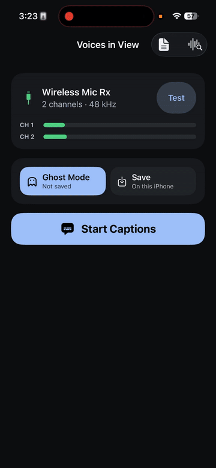

<p align="center">
  
</p>

# Voices in View

[](https://github.com/zredlined/voices-in-view-ios/releases)
[](https://developer.apple.com/ios/)
[](LICENSE)

Voices in View turns in-person conversations into large, real-time captions on an iPhone. It is being built for people who are hard of hearing, bringing an experience similar to FaceTime Live Captions to family gatherings, meetings, and other conversations in the same room.

<p align="center">
  
</p>

## Why this exists

FaceTime Live Captions changed how my dad, who is hard of hearing, can take part in phone conversations. In person, it is harder: several people may be spread around a room, and an iPhone on the table may not hear everyone clearly.

The main problem is often microphone distance. Speech recognition works better when the microphone is close to the person speaking, before room noise and reverberation get mixed in. A two-transmitter wireless system such as DJI Mic Mini lets two people wear microphones while the receiver sends both channels to the iPhone.

Voices in View mixes those channels into one conversation feed and transcribes it with Apple's on-device `SpeechTranscriber`:

`wearable microphones → USB receiver → mixed audio → on-device transcription → live captions`

Keeping one transcript matches how the app is used: the person reading it can usually see who is speaking. It also avoids duplicated captions when both microphones pick up the same voice.

The transcription runs locally. Raw audio is not recorded or uploaded. Saved sessions store finalized caption text on the device; Ghost Mode does not keep the transcript. Apple describes `SpeechTranscriber` as suitable for live, long-form, and distant speech in its [SpeechAnalyzer overview](https://developer.apple.com/videos/play/wwdc2025/277/).

## Requirements

- Xcode 26.6 or newer
- iOS 26 or newer
- A physical iPhone for speech-model and USB-audio validation

The project has no third-party dependencies. Before building from the command line, select the installed Xcode:

```sh
sudo xcode-select -s /Applications/Xcode.app/Contents/Developer
```

Alternatively, prefix commands with `DEVELOPER_DIR=/Applications/Xcode.app/Contents/Developer`.

## First device run

1. Open `VoicesInView.xcodeproj`.
2. Choose a personal development team for the VoicesInView target.
3. Connect an iPhone running iOS 26 and enable Developer Mode.
4. For DJI Mic Mini, use the phone USB-C adapter, power on the receiver, and double-press the link button until its status LED is cyan (Stereo).
5. Run the app, open Diagnostics, and confirm that the input is USB and exposes two channels.

Voices in View downmixes the receiver's available channels into one Apple `SpeechTranscriber` input. Raw audio is never written to disk.

## Privacy modes

- **Saved:** finalized caption text is stored locally with complete file protection and excluded from backup.
- **Ghost:** captions remain in memory for the live session and no transcript files are created.

See [docs/privacy.md](docs/privacy.md) for the user-facing privacy policy.

For setup help or troubleshooting, see [docs/support.md](docs/support.md).

## License

Voices in View is available under the [Apache License 2.0](LICENSE).
